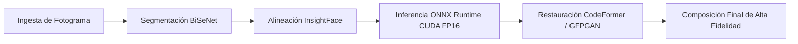

  

<h1 align="center">Bryan Montes · Thekerdruid</h1>

  <strong>Senior Full Stack & Systems Engineer &nbsp;|&nbsp; IA Aplicada & Visión Artificial &nbsp;|&nbsp; Arquitecturas de Alto Rendimiento</strong>

  
  
  
  
  

---

## Sobre Mí & Filosofía de Ingeniería

Soy **Bryan Montes**, desarrollador y arquitecto de software enfocado en la construcción de **sistemas de alta concurrencia, pipelines avanzados de Inteligencia Artificial y arquitecturas web de alto rendimiento**. Mi trabajo combina análisis matemático, optimización a bajo nivel y diseño de infraestructuras desacopladas:

- **Arquitectura Limpia & Modular:** Construcción de sistemas desacoplados, orientados a dominios y basados en microservicios escalables que facilitan la evolución técnica continua sin acumulación de deuda técnica.
- **Rendimiento Extremo:** Optimización rigurosa de latencia: inferencia acelerada con CUDA/FP16, procesamiento asíncrono y tiempos de respuesta sub-segundo con estrategias SSR/SSG.
- **Experiencias Interactivas 3D:** Integración de gráficos en tiempo real mediante WebGL y Three.js, manteniendo estándares de rendimiento Lighthouse 95+.

---

## Dominios de Especialidad

| Área Técnica | Stack & Herramientas Clave | Enfoque de Ingeniería |
| :--- | :--- | :--- |
| **IA & Visión Artificial** | Python · ONNX Runtime · NVIDIA CUDA · OpenCV · InsightFace | Inferencia en tiempo real (FP16), segmentación facial y restauración generativa |
| **Machine Learning & Big Data** | XGBoost · LightGBM · Celery · Redis · PostgreSQL · Playwright | Orquestación distribuida, pipelines reactivos y modelos cuantitativos |
| **Sistemas & iGaming Math** | Node.js · TypeScript · Simulaciones Monte Carlo · CSPRNG | Simulación estocástica masiva (millones de giros/s) y certificación matemática |
| **Frontend Moderno & 3D Web** | Next.js 15 · React 19 · Three.js · React Three Fiber · TailwindCSS | Renderizado 3D a 60 FPS estables, Server Components y accesibilidad AA |

---

## Estándares de Ingeniería & Prácticas de Desarrollo

- **Tipado Estricto de Extremo a Extremo:** TypeScript configurado en modo estricto en frontend/Node.js y Python tipado estáticamente con chequeo continuo para prevención temprana de regresiones.
- **Flujo de Integración y Entrega Continua (CI/CD):** Validación automatizada en cada Pull Request mediante GitHub Actions (análisis estático, linting, tests unitarios y de integración).
- **Infraestructura Inmutable y Reproducible:** Contenerización exhaustiva con Docker y Docker Compose con builds multi-etapa para generar artefactos mínimos, seguros y portables entre entornos.
- **Diseño Resiliente:** Manejo defensivo de excepciones, colas de tareas con reintentos exponenciales y observabilidad mediante logging estructurado.

---

## Patrones de Diseño & Paradigmas de Arquitectura

- **Sistemas Distribuidos & Backend:**
  - *CQRS & Arquitectura Orientada a Eventos:* Segregación de responsabilidades de comando y consulta para maximizar el throughput de lectura y asegurar consistencia transaccional en escritura.
  - *Máquinas de Estado Finito (FSM):* Modelado formal de flujos de verificación bancaria, retención de usuarios y transiciones de estado deterministas en servicios asíncronos y bots.
  - *Inversión de Dependencias:* Desacoplamiento de la infraestructura mediante patrones de Repositorio y Service Layer en FastAPI, Node.js y Next.js.
- **Inferencia de IA & Procesamiento de Datos:**
  - *Worker Pools & Pipelines Asíncronos:* Distribución de carga con Celery y Redis para aislar tareas CPU/GPU-intensivas sin bloquear el bucle de eventos principal.
  - *Model Caching & Quantization:* Optimización de memoria en inferencia mediante modelos ONNX en media precisión (FP16) y precarga de pesos en VRAM para eliminar cold-starts.
- **Frontend de Alto Rendimiento:**
  - *React Server Components (RSC):* Minimización del tamaño del bundle JavaScript del cliente y serialización eficiente de datos directamente desde el servidor.
  - *Atomic Design & Shaders WebGL:* Componentización modular estricta y optimización de shaders GLSL para renderizado 3D a 60 FPS estables.

---

## Seguridad, Hardening & Criptografía

- **Aleatoriedad Criptográfica Certificable (CSPRNG):** Generación de entropía estadística no predecible conforme a normativas internacionales de certificación de software para iGaming (GLI / iTech Labs).
- **Validación Estricta en Fronteras:** Validación en tiempo de compilación y runtime de esquemas de datos mediante Pydantic (Python) y Zod (TypeScript), previniendo inyecciones y datos malformados antes de ingresar a la capa de dominio.
- **Defensa en Profundidad & Control de Acceso:**
  - Hashing criptográfico robusto (Argon2 / bcrypt) para credenciales y autenticación basada en tokens JWT con expiración corta y rotación.
  - Limitación de tasa (*Rate Limiting*) defensiva en memoria sobre Redis para mitigar ataques de fuerza bruta y denegación de servicio (DDoS).

---

## Investigación & Exploración Técnica Activa (I+D)

Líneas de investigación tecnológica y desarrollo experimental continuo:

- **Sistemas de Agentes Autónomos & LLMs Locales:** Cuantización eficiente de modelos de lenguaje (GGUF, AWQ), inferencia de baja latencia con vLLM y orquestación de agentes con memorias vectoriales.
- **Aceleración con Rust & WebAssembly:** Compilación de núcleos matemáticos y de simulación a WASM para ejecutar procesamiento intensivo a velocidad nativa en navegadores.
- **Patrones Event-Driven Distribuidos:** Implementación de Event Sourcing y CQRS para arquitecturas distribuidas de alta concurrencia y consistencia eventual.

---

## Proyectos Destacados

### [EXON-FACE](https://github.com/bmontes93/EXON-FACE) — Sistema de Visión Artificial y Procesamiento Facial

Motor de análisis, segmentación y transposición facial de alta fidelidad diseñado para flujos de procesamiento en imagen y vídeo de calidad cinematográfica.

- **Pipeline de Inferencia:** Segmentación anatómica a nivel de píxel mediante BiSeNet para generación de máscaras faciales exactas (ojos, labios y contornos). Incorpora restauración generativa con CodeFormer y GFPGAN para reconstrucción nítida en baja resolución.
- **Aceleración por Hardware:** Motor sobre ONNX Runtime optimizado para núcleos NVIDIA CUDA en media precisión (FP16), reduciendo drásticamente la latencia por fotograma.
- **Entorno de Producción:** Empaquetado completo en Docker, scripts de inicialización automatizados, CLI para procesamiento en lote e interfaz gráfica interactiva en Gradio.
- **Accesos Técnicos:** [Código Fuente](https://github.com/bmontes93/EXON-FACE) &nbsp;·&nbsp; [Documentación del Repositorio](https://github.com/bmontes93/EXON-FACE#readme)

---

### Motor Predictivo ML & Value-Betting Deportivo

Pipeline cuantitativo continuo de extracción de datos en tiempo real, modelado estadístico y detección de ineficiencias de cuotas en fútbol internacional.

- **Orquestación Temporal Automatizada:** Pipeline asíncrono accionado por ventanas temporales estrictas: análisis de noticias y bajas en T-24h, captura de cuotas base en T-12h, extracción reactiva de alineaciones oficiales en T-60min (Sofascore) e inferencia probabilística en T-55min.
- **Modelado Probabilístico Calibrado:** Algoritmos supervisados (XGBoost y LightGBM) entrenados para estimar la probabilidad real (`P_bot`) sobre mercados de alta liquidez (córneres, tarjetas y goles combinados).
- **Ventaja Matemática (Edge):** Filtro cuantitativo con margen de seguridad probabilístico (`(1 / P_bot) * (1 + α) < Cuota_Bookie` con `α = 0.05`), disparando alertas de valor esperado positivo únicamente cuando existe una ineficiencia medible en el mercado.

---

### [quantslot-sdk](https://github.com/bmontes93/quantslot-sdk) — Motor Matemático y Simulación Estocástica para iGaming

Motor matemático de simulación probabilística y certificación de slots digitales conforme a los estándares técnicos exigidos por laboratorios internacionales (GLI, iTech Labs).

- **Simulador Monte Carlo Masivo:** Capacidad para ejecutar millones de giros en pocos segundos, validando empíricamente curvas de volatilidad, distribución de frecuencias (*hit frequency*) y RTP teórico.
- **Mecánicas Dinámicas Complejas:** Soporte para estructuras dinámicas Cluster-Pay (5x5), sistemas de cascadas infinitas, multiplicadores acumulativos y rondas de bonificación multinivel.
- **Aleatoriedad Certificable:** Generador de números aleatorios criptográficamente segura (CSPRNG) para garantizar uniformidad estadística y total ausencia de patrones predictibles.
- **Accesos Técnicos:** [Código Fuente](https://github.com/bmontes93/quantslot-sdk) &nbsp;·&nbsp; [Documentación del SDK](https://github.com/bmontes93/quantslot-sdk#readme)

---

### TAHUAGYM — Plataforma Web de Alto Rendimiento con Renderizado 3D

Plataforma web comercial diseñada para brindar una experiencia interactiva inmersiva y cinematográfica, manteniendo un rendimiento sobresaliente de **Lighthouse 95+**.

- **Arquitectura Web Moderna:** Renderizado híbrido SSR/SSG mediante Next.js App Router (React Server Components), arquitectura de diseño atómico y carga perezosa (*lazy loading*) de recursos pesados.
- **Visualizador 3D en Tiempo Real:** Renderizado interactivo de productos mediante Three.js y React Three Fiber con geometrías y shaders optimizados para mantener 60 FPS estables en dispositivos móviles y de escritorio.
- **Accesibilidad y SEO Técnico:** Cumplimiento de estándares WCAG AA, navegación completa por teclado, estructura semántica e integración de datos estructurados JSON-LD.

---

## Métricas de Rendimiento & Benchmarks Cuantitativos

| Sistema / Proyecto | Métrica Principal | Benchmark / Resultado Técnico | Entorno de Ejecución |
| :--- | :--- | :--- | :--- |
| **EXON-FACE** | Latencia de inferencia por frame | Reducción significativa de tiempo de procesamiento vs FP32 | NVIDIA CUDA / Tensor Cores |
| **Motor Predictivo ML** | Ventana de ejecución de inferencia | Pipeline de ingesta, cálculo y alerta completado en <90s | Celery Workers + Redis Cache |
| **quantslot-sdk** | Throughput de simulación estocástica | Millones de tiradas simuladas y analizadas en segundos | Node.js V8 Engine / In-Memory |
| **TAHUAGYM** | Core Web Vitals (Lighthouse) | 95+ Performance, 100 Accesibilidad, 100 SEO | Next.js Server Components |

---

## Trayectoria de Impacto & Hitos Técnicos

| Dominio de Ingeniería | Hito Técnico / Impacto de Producción | Paradigma Tecnológico |
| :--- | :--- | :--- |
| **Simulación Estocástica** | Motor de certificación para iGaming capaz de procesar >1,000,000 giros/segundo sin desviación estadística | Node.js · CSPRNG · Monte Carlo |
| **Visión Artificial en Tiempo Real** | Pipeline cinematográfico de transposición facial con latencia minimizada en GPUs con Tensor Cores | Python · ONNX Runtime · CUDA FP16 |
| **Modelado Predictivo Deportivo** | Orquestación distribuida de extracción, inferencia y evaluación de cuotas en <90s antes del inicio de eventos | XGBoost · Celery · Redis · Playwright |
| **Plataformas Web Inmersivas** | Experiencia comercial con renderizado 3D interactivo en tiempo real alcanzando puntuaciones Lighthouse 95+ | Next.js · Three.js · React Three Fiber |
| **Automatización & Ecosistemas SaaS** | Arquitectura modular de bots y gestión de membresías con verificación FSM y pasarelas de pago | FastAPI · PostgreSQL · aiogram 3 · Docker |

---

<b>Ver más proyectos de arquitectura y software especializado</b>

 

#### Ecosistema SaaS de Automatización & Pagos para Telegram
> **Python · aiogram 3 · FastAPI · PostgreSQL · SQLAlchemy 2.0 · Redis · APScheduler · Docker**

Arquitectura distribuida para control de accesos, verificación de pagos y retención de usuarios en comunidades privadas mediante tres bots paralelos:
* **Verificación:** Procesamiento y validación de comprobantes bancarios mediante máquinas de estado finito (FSM), delegación a paneles administrativos y emisión de enlaces de invitación de un solo uso.
* **Retención:** Agente en segundo plano con APScheduler para avisos preventivos de renovación y revocación automática de membresías inactivas.
* **Difusión:** Módulo de comunicaciones segmentadas para campañas programadas de reactivación.

---

#### ALL-DAY — Plataforma SaaS para Gestión de Eventos
> **Next.js 15 · React 19 · TypeScript · PostgreSQL · Prisma ORM · Culqi · Resend · Pusher**

Plataforma integral para reservas de eventos y conexión de proveedores locales:
* **Seguridad:** Flujo de validación de identidad de prestadores de servicios y mensajería interna con privacidad protegida.
* **Transaccionalidad:** Sistema de reservas con pagos divididos (anticipo del 50%) integrado con la pasarela Culqi.
* **Tiempo Real:** Notificaciones Push nativas vía Service Workers y avisos in-app en tiempo real mediante Pusher.

---

#### [CALC101NG](https://github.com/bmontes93/CALC101NG) — Motor de Cálculo Simbólico y Gráficas Dinámicas
> **React · TypeScript · Vite · MathLive · Function-Plot · Python · FastAPI · SymPy · Docker**

Plataforma de análisis matemático simbólico:
* Backend asíncrono con FastAPI y SymPy para simplificación algebraica, derivadas e integrales analíticas en milisegundos.
* Editor visual interactivo WYSIWYG mediante MathLive y graficación matemática en 2D reactiva con Function-Plot.
* **Accesos Técnicos:** [Código Fuente](https://github.com/bmontes93/CALC101NG) &nbsp;·&nbsp; [Documentación de la API](https://github.com/bmontes93/CALC101NG#readme)

---

#### [GEST E-Commerce](https://github.com/bmontes93/GEST-E-COMERCE) — Arquitectura E-Commerce Desacoplada
> **TypeScript · React · Vite · Python · FastAPI · Docker Compose · JWT**

Infraestructura de tienda virtual con separación completa entre capa de presentación y servicios de backend:
* Microservicios contenerizados de despliegue independiente orquestados con Docker Compose.
* Sistema de autenticación seguro basado en tokens JWT y panel administrativo integral para inventario y órdenes.
* **Accesos Técnicos:** [Código Fuente](https://github.com/bmontes93/GEST-E-COMERCE)

---

#### [Hide-Clone-USB](https://github.com/bmontes93/Hide-Clone-USB) — Servicio de Sincronización Orientado a Eventos
> **PowerShell · Robocopy (32 Hilos) · Windows Task Scheduler**

Servicio silencioso en segundo plano para sincronización y respaldo automatizado de unidades de almacenamiento:
* Desencadenamiento reactivo mediante eventos de sistema (`DriverFrameworks`), eliminando el consumo continuo de CPU por polling.
* Copia masiva multihilo a 32 subprocesos concurrentes con permisos elevados del sistema operativo.
* **Accesos Técnicos:** [Código Fuente](https://github.com/bmontes93/Hide-Clone-USB)

---

## Stack Tecnológico

### Inteligencia Artificial & Computación Científica

  
  
  
  
  

### Frontend & Arquitectura Web

  
  
  
  
  
  
  

### Backend, Bases de Datos & Caché

  
  
  
  
  
  
  

### Testing, DevOps & Automatización

  
  
  
  
  
  

---

## Disponibilidad Profesional & Contacto

Disponible para posiciones senior de ingeniería, liderazgo técnico y consultoría de arquitectura de sistemas:

- **Roles de Interés:** Senior Full Stack Engineer · Tech Lead · Especialista en Inferencia de IA & Arquitectura Backend.
- **Modalidad:** Remoto internacional / Híbrido.
- **Zona Horaria:** UTC-5 (disponibilidad operativa para alineación con equipos en EE.UU., LATAM y Europa).
- **Canal Directo:** [LinkedIn](https://www.linkedin.com/in/bmontesdev/) &nbsp;|&nbsp; [bmontesr930620@gmail.com](mailto:bmontesr930620@gmail.com) &nbsp;|&nbsp; [bmontesdev.me](https://bmontesdev.me)

---

## Métricas de Actividad

  
  

---

  <i>"Transformando requerimientos de alta complejidad en arquitecturas de software robustas, eficientes y escalables."</i> 
  <b>Bryan Montes · Thekerdruid</b>

